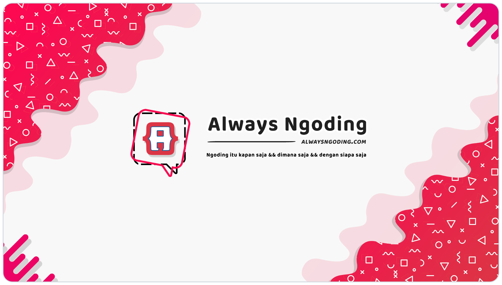

# Always Ngoding



**Platform belajar pemrograman interaktif berbahasa Indonesia, dengan gamifikasi dan komunitas dalam satu website.**

Always Ngoding bermula dari project pribadi pada 2018 untuk mengasah kemampuan programming sekaligus membantu orang yang baru belajar ngoding. Project ini berkembang menjadi tempat belajar gratis, berbagi artikel, berdiskusi, mengumpulkan pencapaian, dan memperoleh sertifikat.

Source code ini dibagikan untuk melanjutkan manfaat dari perjalanan tersebut: dipelajari, dijalankan sendiri, dimodifikasi, dan disempurnakan bersama. Rilis ini merupakan arsip dari layanan lama yang memasuki masa maintenance dan penutupan; tidak ada jadwal maintenance, dukungan, atau pembaruan keamanan yang dijanjikan.

**Ingin mendukung founder dan perjalanan project ini? Kunjungi [GitHub ZihxS](https://github.com/ZihxS) untuk melihat opsi sponsor dan dukungan yang tersedia.**

Yuk, mampir dan sapa juga di **[TikTok @msalehsolahudin](https://www.tiktok.com/@msalehsolahudin)**! Kalau suka, boleh sekalian follow. 💙

> Kode asli menggunakan **Always Ngoding Source-Available License 1.0**. Penggunaan, modifikasi, distribusi gratis, dan pemakaian internal bisnis diperbolehkan. Penjualan ulang serta penyediaan aplikasi atau layanan berbayar kepada pelanggan eksternal dilarang. Karena pembatasan tersebut, lisensi ini bukan lisensi open source menurut definisi OSI. Baca [ketentuan lisensi](#lisensi).

## Daftar isi

- [Untuk siapa project ini?](#untuk-siapa-project-ini)
- [Isi website dan fitur](#isi-website-dan-fitur)
- [Hal yang unik](#hal-yang-unik)
- [Role dan hak akses](#role-dan-hak-akses)
- [Gambaran sistem dan alur](#gambaran-sistem-dan-alur)
- [Tech stack](#tech-stack)
- [Struktur project](#struktur-project)
- [Instalasi dengan Docker](#instalasi-dengan-docker)
- [Instalasi tanpa Docker](#instalasi-tanpa-docker)
- [Konfigurasi environment](#konfigurasi-environment)
- [Database dan data bawaan](#database-dan-data-bawaan)
- [Perintah Makefile](#perintah-makefile)
- [Mengatasi kendala lokal](#mengatasi-kendala-lokal)
- [Batasan arsip dan deployment](#batasan-arsip-dan-deployment)
- [Cara berkontribusi](#cara-berkontribusi)
- [Credits](#credits)
- [Sponsor dan dukungan](#sponsor-dan-dukungan)
- [Lisensi](#lisensi)

## Untuk siapa project ini?

| Pengguna | Manfaat |
| --- | --- |
| Pemula yang ingin belajar ngoding | Mempelajari dasar web melalui materi berbahasa Indonesia, contoh kode, dan latihan bertahap. |
| Anggota komunitas | Membagikan tulisan, bertanya melalui diskusi, membantu anggota lain, dan menampilkan hasil belajar di profil. |
| Pengajar atau komunitas belajar | Mempelajari atau menyesuaikan platform untuk kegiatan belajar gratis, sesuai lisensi. |
| Developer PHP | Mempelajari implementasi aplikasi MVC: autentikasi, role, CRUD, upload, progress belajar, notifikasi, PDF, dan integrasi layanan eksternal. |
| Kontributor | Memperbaiki kode lama, memperbarui materi, meningkatkan keamanan, dan membuat pengalaman lokal lebih mudah. |

Project ini juga bisa menjadi bahan studi bagaimana sebuah website belajar, komunitas, dan panel pengurus dirangkai dalam aplikasi PHP yang merender halaman di server.

## Isi website dan fitur

### Belajar pemrograman

Lima kelas utama yang memiliki materi dan route pembelajaran:

| Kelas | Gambaran materi |
| --- | --- |
| HTML | Struktur halaman, tag dan atribut, teks, multimedia, tabel, serta form. |
| CSS | Styling halaman, properti dasar, teks, background, posisi, layout, transformasi, dan animasi. |
| JavaScript | Sintaks dasar, tipe data, percabangan, perulangan, fungsi, string, array, dan object. |
| PHP | Sintaks dasar, tipe data, percabangan, perulangan, fungsi, serta konsep pemrograman web di server. |
| MySQL | Dasar database, tipe data, query, pengelolaan data, dan relasi melalui SQL. |

Fitur pembelajarannya mencakup:

- Materi dibagi menjadi modul dan bagian agar bisa dipelajari bertahap.
- Editor kode berbasis CodeMirror dan contoh kode di dalam materi.
- Preview latihan HTML/CSS di browser.
- Eksekusi kode PHP/JavaScript melalui Glot jika token integrasinya dikonfigurasi.
- Latihan atau pertanyaan pada bagian pembelajaran tertentu.
- Penyimpanan bagian terakhir yang dipelajari untuk setiap anggota.
- Penambahan poin belajar dan pemeriksaan pencapaian ketika anggota membuat progress.
- Perolehan sertifikat sesuai alur dan syarat kelas yang diimplementasikan.

Materi MySQL menggunakan contoh dan ilustrasi; jangan menganggapnya sebagai terminal SQL bebas yang mengeksekusi query peserta ke database aplikasi. Nama kelas lain yang muncul dalam struktur lama, seperti jQuery atau Python, juga tidak berarti kelas tersebut sudah lengkap dan tersedia.

### Gamifikasi, profil, dan sertifikat

- **Poin belajar:** progress pembelajaran terhubung dengan poin anggota.
- **Pencapaian:** definisi badge/pencapaian beserta catatan perolehannya.
- **Sertifikat:** daftar sertifikat anggota dan halaman sertifikat berbentuk PDF.
- **Profil publik:** identitas anggota, aktivitas, progress, dan hasil belajar.
- **Anggota terbaik mingguan dan Hall of Fame:** pengakuan terhadap aktivitas belajar dan kontribusi komunitas.
- **Notifikasi:** informasi tentang interaksi serta perolehan pencapaian dan sertifikat.

Sertifikat memakai template PDF dan QR yang mengarah ke tautan sertifikat. Sertifikat ini merupakan bagian dari platform; bukan klaim akreditasi pendidikan atau sertifikasi profesional.

### Artikel dan diskusi

| Area | Yang bisa dilakukan |
| --- | --- |
| Artikel publik | Membaca artikel, melihat kategori, memberi suka, dan mengikuti percakapan melalui komentar. |
| Artikel anggota | Membuat, mengubah, melihat preview, dan menghapus tulisan sendiri melalui dashboard anggota. |
| Forum diskusi | Membuat topik, membaca diskusi, mengirim jawaban, dan memberi suka pada interaksi yang tersedia. |
| Moderasi | Pengurus mengelola konten, status, komentar, dan jawaban melalui panel pengurus. |

Artikel dan diskusi adalah konten buatan pengguna, terpisah dari materi kelas yang sebagian besar berada dalam source code/view pembelajaran.

### Fitur komunitas lainnya

- **Lowongan kerja:** daftar dan detail lowongan, komentar/interaksi, serta pengelolaan lowongan sendiri oleh anggota.
- **Suara Anggota:** tempat anggota menyampaikan masukan untuk ditangani pengurus.
- **Halaman tim dan partner:** informasi orang serta pihak di balik project.
- **Donasi:** alur dukungan melalui Midtrans jika dikonfigurasi. Bagian donatur di halaman tim ditampilkan ketika ada data donatur.
- **Notifikasi aktivitas eksternal:** pengiriman ke Discord dan posting Twitter jika integrasi tersedia serta alur aplikasinya mengizinkan.
- **Periklanan dan link iklan:** modul pengelolaan pada panel pengurus. Pengajuan iklan mandiri oleh anggota masih memiliki bagian legacy/coming soon.
- **Sitemap dan metadata:** route sitemap serta metadata untuk halaman publik.

### Dashboard anggota dan panel pengurus

Dashboard anggota menyediakan pengelolaan profil dan kata sandi, artikel sendiri, diskusi sendiri, lowongan sendiri, suara anggota, pencapaian, sertifikat, notifikasi, serta panduan.

Panel pengurus menyediakan pengelolaan konten dan komunitas. Superadmin mendapat tambahan pengelolaan pengguna/role, definisi pencapaian dan sertifikat, donasi, periklanan, konfigurasi website, rekap, dan backup database.

File manager dan pengolahan gambar turut disertakan untuk kebutuhan media editor serta upload. Folder upload arsip telah dibersihkan dari file yang tidak digunakan.

## Hal yang unik

1. **Belajar dan komunitas saling terhubung.** Anggota dapat belajar, memperoleh pencapaian, menulis artikel, membantu diskusi, dan menampilkan kontribusi pada profil yang sama.
2. **Gamifikasi menjadi bagian dari alur belajar.** Poin, badge, progress, sertifikat, dan pengakuan mingguan mengikuti aktivitas anggota.
3. **Materi berbahasa Indonesia dengan latihan langsung.** Pembelajaran menggabungkan penjelasan, contoh, editor, dan latihan dalam halaman kelas.
4. **Bisa dijalankan tanpa akun layanan eksternal.** Integrasi yang belum dikonfigurasi menyembunyikan UI terkait dan ditangani juga di server.
5. **Database dapat disesuaikan melalui environment.** Nama database dan prefix tabel dirender dari template SQL; prefix kosong juga didukung.
6. **Docker untuk pengembangan lokal.** Kode dibagikan langsung ke container, sehingga perubahan halaman cukup dilihat dengan refresh browser.
7. **Arsip pengalaman platform nyata.** Source mempertahankan fitur serta pola pengembangan dari perjalanan project, dengan data produksi pengguna dikeluarkan dari rilis.

## Role dan hak akses

Database memiliki tiga nilai role: `anggota`, `admin`, dan `superadmin`. Pengunjung yang belum login merupakan tamu, bukan role akun dalam database.

| Role | Akses utama | Area |
| --- | --- | --- |
| Tamu | Melihat halaman publik, daftar kelas, artikel, diskusi, lowongan, profil publik, dan halaman tim; login atau mendaftar jika pendaftaran tersedia. | Website publik |
| `anggota` | Mengikuti pembelajaran dengan progress akun, berinteraksi, mengelola profil dan konten sendiri, melihat pencapaian/sertifikat, serta menyampaikan masukan. | `/anggota` dan website publik |
| `admin` | Masuk ke panel pengurus dan menangani pengelolaan konten/komunitas yang tersedia bagi admin. | `/area-pengurus` |
| `superadmin` | Akses pengurus ditambah fitur khusus pengguna/role, pencapaian, sertifikat, periklanan, data donasi, konfigurasi, dan backup. | `/area-pengurus` |

Pengelolaan artikel, diskusi, dan lowongan tetap mengikuti kepemilikan, status, serta pemeriksaan akses di masing-masing handler. Tabel ini menggambarkan pembagian utama, bukan spesifikasi lengkap setiap endpoint.

Atribut premium yang ada dalam struktur legacy bukan role keempat dan bukan izin untuk menyediakan versi berbayar. Penggunaan aplikasi tetap mengikuti lisensi.

**Akun awal untuk lokal:** `ZihxS` / `admin123`, berstatus aktif dan memiliki role `superadmin`, dengan foto `blank.png` serta profil sintetis. Akun ini adalah seed demonstrasi, bukan kredensial layanan produksi.

Untuk mencoba pengalaman anggota tanpa SMTP, masuk sebagai superadmin, buat akun dengan role `anggota` melalui menu **Pengguna**, lalu login menggunakan akun tersebut di `/masuk`. Pembuatan akun oleh pengurus tidak membutuhkan alur verifikasi email pendaftaran publik.

## Gambaran sistem dan alur

### Arsitektur aplikasi

```text
                         +------------------------+
                         | Browser                |
                         | HTML / CSS / JavaScript|
                         +-----------+------------+
                                     |
                  +------------------+------------------+
                  | HTTP + AJAX                         | Socket.IO
                  v                                     v
      +--------------------------+          +--------------------------+
      | Apache + PHP             |          | Node.js + Express        |
      | CodeIgniter 3            |          | socket/ang.js            |
      |                          |          |                          |
      | routes                   |          | Siaran event perubahan   |
      |   -> controllers         |          | ke client yang terhubung |
      |   -> models / libraries  |          +--------------------------+
      |   -> views               |
      +------------+-------------+
                   |
          +--------+-------------------+----------------------+
          |                            |                      |
          v                            v                      v
 +--------------------+   +------------------------+  +--------------------+
 | MySQL              |   | Penyimpanan file       |  | Integrasi opsional |
 | Akun dan role      |   | Media dan upload       |  | SMTP / reCAPTCHA   |
 | Progress dan poin  |   | Cache, log, session    |  | Midtrans / Glot    |
 | Konten komunitas   |   | Template sertifikat    |  | Discord / Twitter  |
 | View/trigger/SP    |   | Backup database        |  |                    |
 +--------------------+   +------------------------+  +--------------------+
```

PHP menangani halaman, validasi, autentikasi, otorisasi, dan perubahan data melalui MySQL. JavaScript/AJAX menangani interaksi pada halaman. Socket.IO menyampaikan event pembaruan agar bagian UI terkait dapat diperbarui; database tetap dikelola melalui aplikasi PHP.

### Alur pengguna

```text
 Pengunjung
     |
     +--> Baca artikel / diskusi / lowongan / profil / informasi tim
     |
     +--> Login, atau daftar jika SMTP sudah siap
                  |
                  v
             Akun anggota
                  |
       +----------+--------------------+----------------------+
       |                               |                      |
       v                               v                      v
 Pilih kelas                     Berkontribusi           Kelola profil
       |                         di komunitas            dan konten sendiri
 Baca bagian materi                    |
       |                         Artikel / diskusi
 Latihan / contoh kode           Jawaban / komentar
       |                         Lowongan / masukan
 Progress + poin                       |
       |                               v
 Pencapaian / sertifikat          Interaksi dan notifikasi
       |
       v
 Profil dan dashboard menampilkan hasil belajar

 Pengurus: moderasi konten dan komunitas
 Superadmin: pengelolaan sistem, pengguna, konfigurasi, dan backup
```

### Alur persiapan database

```text
 raw_db.sql                         Environment aktif
 (schema + seed bersih)             (nama DB, prefix, user)
       |                                   |
       +----------------+------------------+
                        |
                        v
               scripts/generate_db.py
                        |
                        v
                 SQL siap import
                        |
            +-----------+------------------+
            |                              |
            v                              v
       make db                        Docker database-seed
       -> db.sql                      -> volume seed
       -> import manual               -> import saat DB pertama dibuat
```

Generator tidak membuat akun MySQL, tidak menulis password database ke SQL, dan tidak melakukan migrasi data yang sudah ada.

## Tech stack

Versi berikut merujuk pada source, lockfile, dan konfigurasi Docker yang disertakan, bukan klaim versi terbaru masing-masing teknologi.

### Runtime dan backend

| Teknologi | Versi / penggunaan |
| --- | --- |
| PHP | Docker memakai **8.3**; gunakan PHP **8.2 atau 8.3** untuk dependency Composer yang terkunci. |
| CodeIgniter | **3.1.10**, framework MVC pada folder `sistem/`. |
| Apache | Web server dari image `php:8.3-apache-bookworm`, dengan rewrite dan konfigurasi akses file. |
| MySQL | Docker memakai **8.4**, koneksi aplikasi melalui `mysqli`; schema memakai view, trigger, dan stored procedure. |
| Node.js | Docker memakai **22 Alpine** untuk layanan socket. |
| Express | **4.22.3** pada lockfile socket. |
| Socket.IO | **4.8.3**, event pembaruan melalui WebSocket/HTTP polling. |
| Python | Python 3 untuk generator SQL; image seed memakai **3.13 Alpine**. Tidak menjadi runtime website. |
| Composer / npm | Pengelolaan dependency PHP dan Node.js, dengan lockfile. |
| Docker Compose / Make | Menjalankan layanan lokal dan menyediakan shortcut perintah. |

### Antarmuka dan editor

- HTML, CSS, JavaScript, jQuery, dan AJAX; halaman dirender oleh PHP.
- Bootstrap **4.5.2** pada website publik, serta tema AdminBSB/Bootstrap pada panel pengurus.
- CodeMirror **5.55.0** untuk editor kode pembelajaran.
- CKEditor **4.5.10** untuk editor konten.
- Komponen antarmuka lain yang dibundel, seperti DataTables, SweetAlert, dan ikon.
- ResponsiveFilemanager **9.14.0** untuk pengelolaan berkas editor.

Project tidak memerlukan proses build SPA atau bundler frontend untuk menjalankan halaman utamanya. Sebagian aset/library frontend adalah versi legacy; pembaruannya merupakan area kontribusi yang berguna.

### Dependency PHP utama

| Library | Versi terkunci | Kegunaan |
| --- | --- | --- |
| `vlucas/phpdotenv` | 5.5.0 | Membaca konfigurasi environment. |
| `phpmailer/phpmailer` | 6.12.0 | Pengiriman email melalui SMTP. |
| `setasign/fpdi` | 2.6.8 | Mengolah template PDF untuk sertifikat. |
| `ezyang/htmlpurifier` | 4.17.0 | Sanitasi HTML. |
| `freepik-labs/dom-purify` | 0.2.6 | Pengolahan/sanitasi HTML. |
| `abraham/twitteroauth` | 2.0.1 | Integrasi posting Twitter legacy. |

Dependency lain dicatat pada [composer.lock](composer.lock) dan [socket/package-lock.json](socket/package-lock.json). Ada juga library legacy yang dibundel langsung, termasuk pengolahan PDF/Excel; kompatibilitasnya perlu diperhatikan saat memperbarui runtime.

## Struktur project

```text
.
+-- aplikasi/
|   +-- config/           Konfigurasi aplikasi, database, routes, SMTP
|   +-- controllers/      Website, belajar, anggota, pengurus, autentikasi
|   +-- helpers/          Keputusan ketersediaan integrasi opsional
|   +-- libraries/        Logika pendukung aplikasi
|   +-- models/           Akses data dan logika pembelajaran/komunitas
|   +-- views/            Halaman dan materi pembelajaran
|   +-- cache/            Cache runtime
|   +-- logs/             Log runtime
+-- sistem/               Framework CodeIgniter
+-- perpustakaan/         Library, aset frontend, file manager, backup legacy
+-- media/                Gambar statis, template, dan folder upload
+-- socket/               Layanan Node.js / Socket.IO
+-- scripts/              Generator SQL
+-- docker/               Entrypoint, Apache/PHP, seed, watcher socket
+-- raw_db.sql            Template schema dan seed yang telah dibersihkan
+-- Dockerfile            Image aplikasi, socket, database, dan seed
+-- compose.yaml          Susunan layanan serta volume lokal
+-- Makefile              Perintah database dan Docker
+-- .env.example          Contoh konfigurasi PHP/native
+-- .env.docker.example   Contoh konfigurasi Docker
+-- composer.json         Dependency PHP
+-- composer.lock         Versi dependency PHP terkunci
+-- SECURITY.md           Pelaporan kerentanan
+-- LICENSE               Lisensi kode asli project
+-- README.md
```

`vendor/`, `socket/node_modules/`, `.env`, `.env.docker`, dan `db.sql` merupakan dependency atau konfigurasi/hasil lokal yang tidak perlu dimasukkan ke Git.

## Instalasi dengan Docker

Docker merupakan cara paling praktis untuk menjalankan project ini di lokal. PHP, MySQL, Node.js, Python, Composer, dan dependency aplikasi disiapkan dalam image.

### 1. Persiapan

- Install Docker beserta Docker Compose, lalu jalankan Docker engine. Docker Desktop sudah menyertakan Compose.
- Install Git untuk mengambil repository. `make` diperlukan jika ingin memakai shortcut Makefile; perintah Compose langsung tetap tersedia.
- Pastikan port `8080` dan `1315` belum digunakan, atau sesuaikan di `.env.docker`.
- Koneksi internet diperlukan pada build pertama untuk mengunduh image dan dependency.

Ambil URL clone dari repository GitHub yang sedang Anda baca, lalu jalankan:

```sh
git clone <URL_REPOSITORY_INI> alwaysngoding
cd alwaysngoding
```

`<URL_REPOSITORY_INI>` adalah placeholder yang harus diganti dengan URL repository atau fork Anda.

Untuk langsung menyiapkan file environment dan menjalankan Docker, gunakan `make setup`. Langkah berikut menjelaskan pengaturan dan startup secara terpisah jika ingin menyesuaikan konfigurasi terlebih dahulu.

### 2. Siapkan konfigurasi lokal

Untuk clone baru:

```sh
cp .env.docker.example .env.docker
```

Nilai bawaan cukup untuk penggunaan lokal. Jangan menimpa `.env.docker` yang sudah Anda sesuaikan. Integrasi eksternal boleh dibiarkan kosong.

Docker membaca konfigurasi melalui environment container dan contoh `.env` publik. File `.env` pribadi untuk MAMP/native ditutupi oleh contoh tersebut di dalam container, sehingga pengaturan database native tidak terbawa ke aplikasi Docker.

### 3. Jalankan

```sh
make docker-up
```

Tanpa Make:

```sh
docker compose --env-file .env.docker up -d --build --wait --renew-anon-volumes
```

Build pertama membutuhkan waktu lebih lama. Layanan seed membuat SQL, MySQL mengimpornya ketika database pertama kali diinisialisasi, lalu aplikasi menunggu database dan socket siap.

| Tujuan | Alamat bawaan |
| --- | --- |
| Website | http://localhost:8080 |
| Login anggota | http://localhost:8080/masuk |
| Login pengurus | http://localhost:8080/area-pengurus/masuk |
| Dashboard pengurus | http://localhost:8080/area-pengurus |
| Materi belajar | http://localhost:8080/belajar |
| Halaman tim | http://localhost:8080/tim |
| Layanan socket | http://localhost:1315 |

Login pengurus dengan **ZihxS / admin123**. Untuk akun anggota lokal, lihat [role dan hak akses](#role-dan-hak-akses).

Port aplikasi dan socket dibuka hanya pada loopback mesin lokal. Port MySQL tidak dipublikasikan ke host; aplikasi mengaksesnya melalui jaringan internal Compose.

### 4. Mengedit file saat container berjalan

| Perubahan | Cara melihat hasil |
| --- | --- |
| PHP, view/HTML, CSS, JavaScript aplikasi | Simpan lalu refresh browser. Source dibagikan langsung ke container dan PHP memeriksa perubahan setiap request. |
| Gambar pada folder media statis yang dibagikan | Simpan lalu refresh browser. |
| `socket/ang.js` atau `socket/index.html` | Watcher otomatis me-restart proses socket. |
| `.env.docker`, `Dockerfile`, konfigurasi Docker, dependency Composer/npm | Jalankan `make docker-up` lagi untuk menerapkan konfigurasi/image dan memperbarui volume dependency. |
| `raw_db.sql` | Tidak mengubah database yang sudah ada. Terapkan perubahan schema dengan sadar, atau inisialisasi ulang database lokal jika datanya boleh dihapus. |

Folder media statis yang dibagikan adalah `background`, `belajar`, `hasil`, `lang`, `motivator`, `tim`, dan `website`. Upload pengguna serta file manager disimpan dalam volume Docker, sehingga perubahan berkas upload di host tidak otomatis mengganti isi volume.

### 5. Stop, restart, dan data persisten

```sh
make docker-status
make docker-logs
make docker-restart
make docker-down
```

`docker-restart` menjalankan ulang container yang ada. Untuk menerapkan perubahan environment atau image, gunakan `docker-up`.

Database, upload, berkas file manager, session, encryption key yang dibuat otomatis, cache/log, dan backup disimpan di volume. `make docker-down` tidak menghapus volume tersebut. Jalankan kembali dengan `make docker-up`.

Jika benar-benar ingin memulai ulang dari seed bersih:

```sh
docker compose --env-file .env.docker down --volumes
make docker-up
```

**Perintah `down --volumes` menghapus seluruh data lokal project di volume Docker, termasuk perubahan database dan upload.** Jangan jalankan jika data itu masih dibutuhkan.

Nama database, username, password, dan prefix diterapkan saat inisialisasi pertama. Mengubahnya di `.env.docker` tidak otomatis mengubah atau memigrasikan database dalam volume yang sudah terisi.

## Instalasi tanpa Docker

Gunakan jalur ini jika ingin menjalankan aplikasi dengan Apache/MAMP atau stack PHP lokal lainnya.

### Kebutuhan

- PHP **8.2 atau 8.3** dan Composer. Walaupun rentang pada `composer.json` masih mencantumkan PHP lama, lockfile saat ini membutuhkan PHP 8.2 ke atas dan tidak mendukung PHP 8.4.
- Ekstensi PHP seperti `mysqli`, `mbstring`, `gd`, `zip`, `bcmath`, `exif`, dan dukungan session/OpenSSL; image Docker juga menyediakan `pdo_mysql` serta OPcache.
- Apache dengan `mod_rewrite` dan izin membaca `.htaccess` (`AllowOverride`).
- MySQL; lingkungan Docker memakai MySQL 8.4.
- Python 3 untuk merender SQL.
- Node.js dan npm untuk layanan socket; Docker memakai Node.js 22.
- `make` jika ingin memakai `make db`; generator Python dapat dipanggil langsung.

### 1. Konfigurasi dan dependency PHP

Letakkan project pada document root Apache/MAMP, kemudian dari root project:

```sh
cp .env.example .env
composer install
```

Jika `.env` sudah ada, sesuaikan file tersebut tanpa menimpanya dengan contoh. Untuk instalasi baru, sesuaikan `.env` dengan mesin Anda. Contoh konfigurasi development:

```dotenv
CI_ENV=development
APP_URL=http://localhost:8888/alwaysngoding
ANG_SOCKET_URL=http://localhost:1315
ANG_SOCKET_TRANSPORT_POLLING_URL=http://localhost:1315

DEV_DB_HOSTNAME=127.0.0.1
DEV_DB_PORT=3306
DEV_DB_DATABASE=alwaysngoding_dev
DEV_DB_USERNAME=alwaysngoding_dev
DEV_DB_PASSWORD=isi-password-database-lokal
DEV_DB_DBPREFIX=app_
```

`APP_URL` harus sesuai alamat serta subfolder project yang benar. Pada konfigurasi MAMP tertentu, port MySQL adalah `8889`, bukan `3306`; periksa pengaturan MAMP Anda.

Buat encryption key acak, lalu salin hasilnya ke `APP_ENCRYPTION_KEY` pada `.env`:

```sh
php -r 'echo bin2hex(random_bytes(32)), PHP_EOL;'
```

Jangan gunakan nilai placeholder encryption key dari `.env.example` sebagai key sebenarnya.

### 2. Generate dan import database

Siapkan database dan akun MySQL yang sesuai `.env`. Akun yang digunakan untuk import harus memiliki izin membuat tabel, view, routine, dan trigger pada database tersebut.

```sh
make db
```

Tanpa Make:

```sh
python3 scripts/generate_db.py --env-file .env --input raw_db.sql --output db.sql
```

Import melalui phpMyAdmin atau CLI, menggunakan akun database aplikasi. Contoh berikut mengikuti konfigurasi di atas:

```sh
mysql --host=127.0.0.1 --port=3306 --user=alwaysngoding_dev --password alwaysngoding_dev < db.sql
```

CLI meminta password secara interaktif. Sesuaikan host, port, username, dan nama database. Template menyertakan `CREATE DATABASE IF NOT EXISTS` dan `USE`; pastikan database sudah disiapkan atau akun memiliki izin yang diperlukan.

Stored object menggunakan `DEFINER=CURRENT_USER`. Import sebagai akun yang dikonfigurasi untuk aplikasi agar definernya sesuai. Pada server yang mengaktifkan binary logging, pembuatan trigger/routine dapat membutuhkan konfigurasi tambahan dari administrator database.

### 3. Jalankan socket

Install dependency dari root project:

```sh
npm ci --prefix socket
```

Kemudian jalankan pada terminal terpisah:

```sh
PORT=1315 SOCKET_ALLOWED_ORIGINS=http://localhost:8888 node socket/ang.js
```

Untuk contoh `APP_URL` di atas, origin adalah `http://localhost:8888`, tanpa path `/alwaysngoding`. Sesuaikan jika port atau hostname website berbeda. Beberapa origin dapat dipisahkan dengan koma.

`ang.js` membaca environment proses Node.js; file `.env` PHP tidak otomatis dimuat oleh layanan tersebut. `SOCKET_ALLOWED_ORIGINS` wajib diisi atau layanan socket menolak startup.

### 4. Buka aplikasi

Buka alamat `APP_URL`, kemudian tambahkan `/area-pengurus/masuk` untuk login seed superadmin. Pastikan Apache dapat menulis folder runtime: cache, log, upload, file manager, session yang digunakan, dan folder backup. Berikan izin sesuai user web server, bukan izin global `777`.

## Konfigurasi environment

### File yang digunakan

| File | Digunakan untuk |
| --- | --- |
| `.env.example` | Contoh konfigurasi PHP/native yang boleh dibagikan. |
| `.env` | Konfigurasi pribadi untuk PHP/native/MAMP; diabaikan Git. |
| `.env.docker.example` | Contoh pengaturan Docker yang boleh dibagikan. |
| `.env.docker` | Konfigurasi pribadi untuk Make/Compose; diabaikan Git. |

### Pengaturan inti

| Konfigurasi | Arti |
| --- | --- |
| `CI_ENV` | Memilih environment CodeIgniter; lokal menggunakan `development`. |
| `APP_URL` | URL dasar aplikasi native, termasuk subfolder jika ada. |
| `DEV_DB_*` | Host, port, database, username, password, dan prefix untuk development. |
| `DB_*` | Pengaturan database untuk environment selain development. |
| `DEV_DB_DBPREFIX` / `DB_DBPREFIX` | Prefix tabel dan objek SQL sesuai koneksi aktif; boleh kosong. |
| `APP_ENCRYPTION_KEY` | Key privat aplikasi native. |
| `ANG_SOCKET_URL` / `ANG_SOCKET_TRANSPORT_POLLING_URL` | Alamat layanan socket yang dapat diakses browser. |
| `SOCKET_ALLOWED_ORIGINS` | Allowlist origin aplikasi pada proses Node.js. |
| `SOCKET_MAX_HTTP_BUFFER_SIZE` | Batas ukuran payload socket; default contoh `1000000` byte. |
| `SESSION_COOKIE_NAME`, `CSRF_TOKEN_NAME`, `CSRF_COOKIE_NAME` | Nama cookie session dan token/cookie CSRF. |
| `COOKIE_SECURE`, `COOKIE_HTTPONLY` | Pengaturan cookie; `COOKIE_SECURE=false` untuk HTTP lokal. |
| `APP_SHOW_DEPRECATIONS` | Mengatur output peringatan deprecation development; Docker menonaktifkannya untuk runtime legacy. |
| `CACHE_ASSET_VERSIONING`, `KOMPRES` | Pengaturan aset/cache dan pemilihan aset terkompresi legacy. |
| `SITEMAP_LASTMOD` | Nilai tanggal yang digunakan sitemap. |

Untuk Docker, gunakan `DOCKER_APP_PORT`, `DOCKER_SOCKET_PORT`, `DOCKER_DB_DATABASE`, `DOCKER_DB_USERNAME`, `DOCKER_DB_PASSWORD`, `DOCKER_DB_ROOT_PASSWORD`, dan `DOCKER_DB_PREFIX`. Compose meneruskannya ke layanan terkait sehingga seed dan koneksi aplikasi memakai nilai yang sama.

`DOCKER_APP_ENCRYPTION_KEY` boleh kosong: entrypoint menghasilkan key acak dan menyimpannya dalam volume `app-state` agar bertahan setelah restart.

### Integrasi opsional

Keputusan ketersediaan integrasi dipakai bersama oleh view dan handler server melalui [integrations_helper.php](aplikasi/helpers/integrations_helper.php). Mengisi sebagian kredensial saja tidak cukup untuk mengaktifkan fitur yang memerlukan beberapa key.

| Integrasi | Pengaturan yang diperlukan | Saat belum dikonfigurasi |
| --- | --- | --- |
| reCAPTCHA | `GCAPTCHA=yes`, `RECAPTCHA_SITE_KEY`, `RECAPTCHA_SECRET_KEY` | Widget dan script tidak ditampilkan; server melewati validasi CAPTCHA. Tombol login tetap tersedia. |
| SMTP | `SMTP_ENABLED=true`, host/port dan pengirim valid, serta kredensial jika autentikasi aktif | Pendaftaran publik dan reset password melalui email disembunyikan; endpoint terkait mengembalikan HTTP 503 tanpa mengirim email atau membuat token baru. Login akun yang sudah ada tetap tersedia. |
| Midtrans | `MIDTRANS_SERVER_KEY`, `MIDTRANS_CLIENT_KEY` | Tombol/script pembayaran dan ajakan donasi terkait disembunyikan; endpoint pembayaran mengembalikan HTTP 503 tanpa membuat transaksi. |
| Discord | `DISCORD_WEBHOOK_URL` | Pengiriman aktivitas dilewati. |
| Twitter | `TWITTER_CONSUMER_KEY`, `TWITTER_CONSUMER_SECRET`, `TWITTER_ACCESS_TOKEN`, `TWITTER_ACCESS_TOKEN_SECRET` | Posting aktivitas dilewati. |
| Glot | `GLOT_API_TOKEN` | Tombol eksekusi remote PHP/JavaScript disembunyikan; endpoint eksekusi mengembalikan HTTP 503. Preview HTML/CSS tetap terpisah dari integrasi ini. |

Pengaturan tambahan:

- **SMTP:** `SMTP_HOST`, `SMTP_PORT`, `SMTP_AUTH`, `SMTP_USERNAME`, `SMTP_PASSWORD`, `SMTP_ENCRYPTION`, `MAIL_FROM_ADDRESS`, dan `MAIL_FROM_NAME`. `tls` untuk STARTTLS, `ssl` untuk implicit TLS. Jika autentikasi aktif, username dan password wajib tersedia.
- **Mail catcher lokal:** dapat menggunakan `SMTP_AUTH=false`, port layanan catcher, pengirim lokal yang valid, dan `SMTP_ENCRYPTION` kosong. Dari container, alamat host/layanan harus dapat dijangkau container; `127.0.0.1` mengarah ke container itu sendiri.
- **Midtrans:** `MIDTRANS_IS_PRODUCTION=false` untuk sandbox. `MIDTRANS_SNAP_URL` boleh kosong karena aplikasi memilih URL sandbox/production sesuai flag.
- **reCAPTCHA:** bahasa dapat diatur melalui `RECAPTCHA_LANG`.
- **Discord:** delivery juga mengikuti kondisi environment/alur aplikasi; konfigurasi URL tidak berarti setiap aktivitas development pasti dikirim.

Kelengkapan konfigurasi hanya menentukan apakah fitur tersedia; validitas key, akun provider, koneksi jaringan, dan kompatibilitas API tetap menentukan keberhasilan layanan eksternal.

Untuk Docker, isi integrasi pada `.env.docker` lalu jalankan `make docker-up`. Untuk native, gunakan `.env`. Simpan webhook URL lengkap, password, token, dan secret key hanya dalam konfigurasi privat.

## Database dan data bawaan

[raw_db.sql](raw_db.sql) merupakan template yang telah dibersihkan untuk distribusi. Placeholder `__DB_DATABASE__` dan `__DB_PREFIX__` diganti oleh [scripts/generate_db.py](scripts/generate_db.py).

| Disertakan | Tidak disertakan |
| --- | --- |
| Schema, view, trigger, dan stored procedure. | Database produksi beserta akun pengguna aslinya. |
| Satu akun lokal `ZihxS` dengan password `admin123`. | Artikel, diskusi, jawaban, komentar, dan data suka dari layanan lama. |
| Profil seed sintetis dan foto `blank.png`. | Transaksi, data peserta, riwayat aktivitas, dan token lama. |
| Referensi seperti kategori, definisi pencapaian, dan jenis sertifikat. | Password database atau secret layanan eksternal dalam hasil generator. |

Trigger/initialization membuat progress awal yang baru bagi akun seed. Karena konten komunitas dikosongkan, daftar artikel dan diskusi yang kosong pada instalasi baru merupakan kondisi yang diharapkan.

Pemilihan konfigurasi generator:

| Environment | Nama DB / prefix / user |
| --- | --- |
| `CI_ENV=development` | `DEV_DB_DATABASE`, `DEV_DB_DBPREFIX`, `DEV_DB_USERNAME` |
| Selain development | `DB_DATABASE`, `DB_DBPREFIX`, `DB_USERNAME` |

Contoh penggunaan:

```sh
make db
make db ENV_FILE=.env.example
make db ENV_FILE=.env DB_SQL=/tmp/alwaysngoding-db.sql
```

Generate hanya menyiapkan SQL; import native dilakukan terpisah. Hasil `db.sql` diabaikan Git. Simpan perubahan schema/seed yang ingin dibagikan pada template bersih, bukan pada dump database pribadi.

Prefix untuk query manual maupun pilihan tabel backup harus mengikuti konfigurasi koneksi aktif. Hindari memasukkan prefix database tertentu langsung ke kode.

SQL dikecualikan dari pemindaian Gitleaks sesuai konfigurasi project. Pengecualian ini tidak menilai apakah dump aman: periksa data SQL secara terpisah sebelum membagikannya.

## Perintah Makefile

Jalankan dari root project:

| Perintah | Fungsi |
| --- | --- |
| `make` / `make help` | Tampilkan daftar shortcut dan opsi yang tersedia. |
| `make env` | Buat `.env` dan `.env.docker` dari contoh dengan permission privat; file yang sudah ada tetap digunakan. |
| `make setup` | Jalankan `make env`, lalu build dan jalankan Docker. Shortcut untuk setup awal dari clone baru. |
| `make db` | Generate `db.sql` dari `raw_db.sql` dan `.env`. |
| `make generate-db` | Alias proses generate database yang sama. |
| `make docker-up` | Build dan jalankan layanan, tunggu siap, serta perbarui volume dependency anonim. |
| `make docker-start` | Jalankan layanan dengan image yang sudah tersedia tanpa build. Gunakan setelah stop/down jika image sebelumnya masih sesuai. |
| `make docker-stop` | Stop container sambil mempertahankan container dan volume. Bisa memilih `SERVICE`. |
| `make docker-down` | Stop dan hapus container/jaringan Compose; volume data tetap disimpan. |
| `make docker-build` | Build image saja. Bisa memilih `SERVICE`, kemudian jalankan `docker-up` untuk menerapkannya. |
| `make docker-restart` | Restart container yang ada tanpa menerapkan perubahan environment/image. Bisa memilih `SERVICE`. |
| `make docker-status` | Lihat status layanan. |
| `make docker-logs` | Ikuti log layanan; bisa memilih `SERVICE` dan jumlah baris `TAIL`. Hentikan dengan `Ctrl+C`. |
| `make docker-logs-once` | Tampilkan log terakhir sekali lalu selesai; bisa memilih `SERVICE` dan `TAIL`. |
| `make docker-shell` | Buka Bash dalam container aplikasi. |
| `make docker-socket-shell` | Buka shell dalam container socket. |
| `make docker-db` | Buka CLI MySQL pada database aplikasi memakai kredensial container. Ketik `exit` untuk keluar. |
| `make docker-db-backup` | Export database lengkap, termasuk routine, trigger, dan event, ke file SQL privat di host. |
| `make docker-cache-clear` | Hapus file cache aplikasi dalam container; `index.html` dan `.htaccess` tetap dipertahankan. |
| `make docker-urls` | Tampilkan URL website, login anggota/pengurus, dan socket sesuai konfigurasi container yang berjalan. |

Alias pendek yang tersedia:

| Alias | Perintah lengkap |
| --- | --- |
| `make up` | `make docker-up` |
| `make down` | `make docker-down` |
| `make restart` | `make docker-restart` |
| `make logs` | `make docker-logs` |
| `make status` | `make docker-status` |
| `make shell` | `make docker-shell` |

Contoh penggunaan sehari-hari:

```sh
make setup
make docker-urls
make logs SERVICE=app TAIL=200
make docker-logs-once SERVICE=socket
make restart SERVICE=socket
make docker-db
make docker-db-backup
make docker-cache-clear
```

`make setup` menyiapkan konfigurasi contoh untuk Docker. Pada instalasi native, `.env` hasil `make env` masih perlu disesuaikan, termasuk database dan encryption key, mengikuti [panduan native](#instalasi-tanpa-docker).

Backup bawaan disimpan sebagai `perpustakaan/berkas/database-YYYYMMDD-HHMMSS.sql` pada host, dengan permission privat dan folder yang sudah diabaikan Git. File hanya dipindahkan ke nama akhir setelah export berhasil. Backup adalah salinan data lokal saat ini, bukan template seed yang telah dibersihkan. Jika memilih lokasi lain, simpan di tempat privat yang tidak dimasukkan ke Git. `BACKUP_FILE` yang sudah ada akan diganti setelah export berhasil.

Override yang tersedia:

```sh
make db ENV_FILE=.env.lokal DB_SQL=/tmp/db.sql PYTHON=python3
make docker-up DOCKER_ENV_FILE=.env.docker.lokal
make docker-status COMPOSE="docker compose"
make docker-build SERVICE=app
make docker-stop SERVICE=socket
make docker-db-backup BACKUP_FILE=/tmp/alwaysngoding-backup.sql
```

Make otomatis menggunakan `.env.docker` jika file tersebut ada. `--renew-anon-volumes` pada startup memperbarui dependency Composer/npm yang disimpan di volume anonim; volume bernama untuk database dan upload tetap dipertahankan.

## Mengatasi kendala lokal

| Gejala | Yang perlu diperiksa |
| --- | --- |
| Port sudah digunakan | Ubah `DOCKER_APP_PORT`/`DOCKER_SOCKET_PORT` pada `.env.docker`, lalu `make docker-up`. |
| Database gagal autentikasi setelah `.env.docker` diubah | Volume lama masih memakai kredensial awal. Cocokkan dengan database yang ada atau lakukan inisialisasi ulang jika seluruh data lokal boleh dihapus. |
| Tabel tidak ditemukan setelah prefix diganti | Prefix aplikasi dan schema harus sama. Perubahan environment tidak mengganti nama tabel yang sudah diimport. |
| Route selain halaman utama menjadi 404 pada native | Pastikan `mod_rewrite`, `AllowOverride`, `.htaccess`, dan `APP_URL` sesuai. |
| Tampilan login tidak memiliki CAPTCHA | Normal jika integrasi reCAPTCHA belum dikonfigurasi; form login tetap bisa digunakan. |
| Tombol daftar/reset, donasi, atau run kode tidak ada | Periksa konfigurasi integrasi opsional terkait. UI tersebut sengaja disembunyikan ketika layanan belum siap. |
| Socket tidak tersambung pada native | Pastikan Node.js berjalan, URL/port benar, dan `SOCKET_ALLOWED_ORIGINS` sesuai origin browser. |
| Socket gagal startup karena origin kosong | Isi allowlist pada environment proses Node.js; `.env` PHP tidak otomatis dibaca oleh Node.js. |
| Upload gagal atau cache/log tidak dapat ditulis | Periksa izin folder runtime terhadap user web server. |
| Container seed berstatus exited dengan kode 0 | Normal: layanan seed hanya menjalankan generator sekali, bukan server yang harus terus hidup. |
| Edit dependency atau environment belum diterapkan | Jalankan `make docker-up`; `docker-restart` hanya me-restart container. |
| Edit source tidak terlihat saat memakai Colima | Pastikan folder project dibagikan dengan VM, terutama jika berada di luar folder home. |
| Konten komunitas atau bagian donatur kosong | Data produksi tidak disertakan. Bagian donatur memang disembunyikan jika tidak ada donatur. |
| Sertifikat gagal memuat QR pada native/offline | Pembuatan QR masih memakai layanan eksternal; periksa akses jaringan dan template/berkas pendukung. |

Untuk detail error lokal, lihat `make docker-logs` atau log aplikasi. Redaksi token, cookie, password, webhook URL, dan data pribadi sebelum membagikan log.

## Batasan arsip dan deployment

Setup Docker yang disertakan ditujukan untuk lokal. Password akun seed serta password database bawaan adalah nilai development yang diketahui publik.

Beberapa hal yang perlu diketahui saat mempelajari atau memperluas project:

- **Framework dan library legacy.** Sebagian file PHPExcel/Profiler lama tidak kompatibel secara sintaks dengan PHP 8.3. Keberadaan library tidak menjamin semua fitur legacy berjalan pada runtime modern. PHP 8.4 belum didukung dependency yang terkunci.
- **Layanan eksternal tetap membutuhkan internet.** Sebagian aset memakai CDN, QR sertifikat dibuat melalui layanan eksternal, dan integrasi provider mengikuti ketersediaan serta kebijakan API masing-masing.
- **Socket membutuhkan perbaikan sebelum deployment publik.** Otorisasi pengirim event dan broadcast global yang membawa token/IP perlu ditinjau dan diperbaiki. Allowlist CORS bukan pengganti autentikasi serta otorisasi event.
- **Belum ada migrasi otomatis.** Template SQL menyiapkan instalasi awal; perubahan schema harus dikelola terpisah untuk database yang telah digunakan.
- **Ada fitur legacy/coming soon.** Entri kelas tambahan, atribut premium, dan pengajuan iklan tertentu belum merupakan fitur lengkap yang bisa dijanjikan kepada pengguna.
- **Tidak ada jaminan pemeliharaan.** Pengelola fork atau instalasi bertanggung jawab atas operasional, data, dan pembaruan versi yang mereka jalankan.

Simpan secret di environment privat. Secret yang pernah terekspos harus dicabut atau dirotasi di provider; memindahkannya ke `.env` tidak membatalkan secret lama. Jangan menggunakan dump atau upload pengguna produksi sebagai data contoh.

Aturan Apache yang disertakan membatasi akses HTTP ke file environment, SQL, metadata Git, backup, dan berkas internal tertentu. Jika memakai web server lain, terapkan aturan yang setara. Jika suatu fork akan dipublikasikan sebagai layanan, periksa autentikasi/role, upload dan file manager, session/CSRF, integrasi, serta keamanan socket sesuai perubahan yang dibuat.

Pelaporan kerentanan mengikuti [SECURITY.md](SECURITY.md). Jangan membagikan detail celah atau kredensial di issue publik.

## Cara berkontribusi

Kontribusi dapat berupa perbaikan bug, penyempurnaan materi, dokumentasi, desain antarmuka, aksesibilitas, pembaruan dependency, maupun perbaikan keamanan. Fokus utamanya adalah menyempurnakan yang sudah ada dengan perubahan yang mudah dipahami dan ditinjau.

### Alur kontribusi di GitHub

1. Baca README dan [LICENSE](LICENSE). Untuk perubahan besar, buka issue agar ruang lingkup dan pendekatannya dapat dibahas terlebih dahulu.
2. Fork repository ke akun GitHub Anda.
3. Clone fork, lalu buat branch yang menjelaskan perubahan:

   ```sh
   git clone <URL_FORK_ANDA> alwaysngoding
   cd alwaysngoding
   git switch -c fix/nama-perbaikan
   ```

4. Jalankan project secara lokal, misalnya dengan Docker. Ubah bagian yang relevan dan jaga satu fokus utama dalam satu pull request.
5. Pastikan alur yang Anda ubah dapat digunakan. Jelaskan cara verifikasi yang benar-benar dilakukan; sertakan screenshot untuk perubahan tampilan bila membantu reviewer.
6. Commit dan push branch ke fork:

   ```sh
   git add <FILE_YANG_DIUBAH>
   git commit -m "Perbaiki deskripsi singkat masalah"
   git push origin fix/nama-perbaikan
   ```

7. Buka pull request ke repository asal. Isi deskripsi masalah, perilaku sebelum/sesudah, cara menjalankan perubahan, dan dampak konfigurasi atau schema jika ada.

Repository belum menyediakan suite pengujian otomatis yang lengkap. Script `npm test` pada layanan socket masih berupa placeholder, sehingga tidak dapat digunakan sebagai bukti bahwa perubahan telah diverifikasi.

### Kebiasaan yang membantu review

- Ikuti pola MVC dan gaya kode di bagian yang disentuh; hindari perubahan format massal bersama perbaikan kecil.
- Pertahankan pemeriksaan login, role, kepemilikan konten, dan validasi server pada handler yang diubah.
- Gunakan prefix database dari konfigurasi, bukan nama tabel berprefix yang di-hardcode.
- Gunakan keputusan ketersediaan integrasi yang sama pada UI dan server. Jangan hanya menyembunyikan tombol jika endpoint tetap menjalankan proses.
- Jika menambah konfigurasi, perbarui contoh environment dan README. Untuk Docker, pastikan konfigurasi diteruskan melalui Compose bila diperlukan.
- Gunakan data sintetis pada contoh SQL. Jangan commit `.env`, `.env.docker`, `db.sql`, log, backup, token, session, atau data pengguna asli.
- Pertahankan kredit dan lisensi kode asli maupun dependency pihak ketiga. Perubahan pada library vendor sebaiknya disertai alasan dan rujukan asal.
- Hindari menambahkan keharusan memiliki key provider hanya untuk menjalankan fitur dasar aplikasi.

### Area yang bisa disempurnakan

| Area | Contoh kontribusi |
| --- | --- |
| Materi belajar | Memperbaiki contoh, penjelasan, typo, atau latihan yang sudah ada. |
| Pengalaman pengguna | Memperjelas empty state, validasi form, navigasi, tampilan mobile, dan aksesibilitas. |
| Keamanan socket | Mengikat event pada identitas/izin pengirim dan membatasi penerima data sensitif. |
| Kompatibilitas runtime | Memperbarui library legacy serta fitur PDF/Excel agar berjalan dengan dependency yang didukung. |
| Kode frontend | Menyederhanakan aset legacy dan membuat bagian yang sulit dibaca lebih mudah dirawat. |
| Database | Menyusun perubahan schema yang dapat diterapkan tanpa menghapus data dan tetap mendukung prefix configurable. |
| Dokumentasi | Menambahkan panduan fitur, memperjelas setup untuk lingkungan lain, dan memperbarui daftar batasan sesuai perbaikan nyata. |

Untuk laporan bug biasa, sertakan langkah reproduksi, hasil yang diharapkan, hasil aktual, serta informasi lingkungan yang relevan. Untuk laporan keamanan, gunakan jalur privat pada [SECURITY.md](SECURITY.md), bukan issue publik. Penerimaan kontribusi mengikuti ketersediaan pengelola arsip; tidak ada waktu respons yang dijanjikan.

## Credits

Nama dan peran berikut mengikuti halaman **Tim** pada aplikasi:

| Nama | Peran |
| --- | --- |
| [Muhammad Saleh Solahudin / ZihxS](https://github.com/ZihxS) | Founder of Always Ngoding |
| [Karmila Sriwulan](https://www.tiktok.com/@alew_milew) | Co-founder of Always Ngoding |
| [Dhimas MS Putra](https://github.com/dhimas2jz) | Co-founder of Always Ngoding |

Terima kasih kepada komunitas yang pernah belajar, berdiskusi, berbagi tulisan, memberi masukan, dan mendukung Always Ngoding. Perjalanan project ini juga terbantu oleh para pembuat framework, library, aset, dan layanan yang digunakan; karya mereka tetap mengikuti kredit serta lisensi masing-masing.

Halaman tim dapat dilihat pada `/tim`; source-nya ada di [tim.php](aplikasi/views/web/lainnya/tim.php).

## Sponsor dan dukungan

Jika project ini pernah membantu Anda belajar atau Anda ingin mendukung founder, kunjungi **[https://github.com/ZihxS](https://github.com/ZihxS)** untuk melihat opsi sponsor/dukungan yang tersedia pada profil tersebut.

Lagi mampir ke project ini? Sekalian mampir juga ke **[TikTok @msalehsolahudin](https://www.tiktok.com/@msalehsolahudin)**, ya! Kalau suka, boleh follow dan sapa di sana. Terima kasih sudah ikut mendukung perjalanan Always Ngoding. 💙

Dukungan juga bisa diberikan dengan membagikan project, memberi star di repository GitHub, melaporkan bug dengan jelas, memperbaiki dokumentasi, atau mengirim pull request. Dukungan tidak menjanjikan jadwal maintenance atau layanan tertentu.

## Lisensi

Kode dan dokumentasi asli project mengikuti **Always Ngoding Source-Available License 1.0**, tersedia di [LICENSE](LICENSE). Layanan socket memiliki salinan lisensi pada [socket/LICENSE](socket/LICENSE).

| Aktivitas untuk kode asli project | Ketentuan |
| --- | --- |
| Menggunakan, mempelajari, dan memodifikasi untuk belajar atau kebutuhan pribadi | Diizinkan. |
| Menggunakan secara internal di bisnis, termasuk bisnis berorientasi profit | Diizinkan. |
| Menjalankan aplikasi publik gratis | Diizinkan sesuai ketentuan lisensi. |
| Membagikan kode atau hasil modifikasi secara gratis | Diizinkan dengan tetap menyertakan lisensi dan copyright. |
| Menjual ulang kode/aplikasi, termasuk versi yang dimodifikasi atau diganti mereknya | Dilarang. |
| Menyewakan atau menawarkan hosting aplikasi, SaaS, langganan, kelas melalui aplikasi, atau fitur berbayar kepada pelanggan eksternal | Dilarang. |

Modifikasi privat tidak wajib dipublikasikan. Izin penggunaan internal bisnis tidak menghapus larangan penjualan ulang atau penyediaan layanan aplikasi berbayar kepada pihak luar. Teks lisensi adalah acuan lengkap untuk ketentuannya.

Kode dan aset pihak ketiga tetap memakai lisensi masing-masing. Lisensi project tidak mengganti lisensi mereka; periksa ketentuan komponen yang dibundel, termasuk ResponsiveFilemanager, sebelum menggunakannya dalam konteks bisnis atau distribusi yang berbeda.

Copyright (c) 2026 **Muhammad Saleh Solahudin**.
